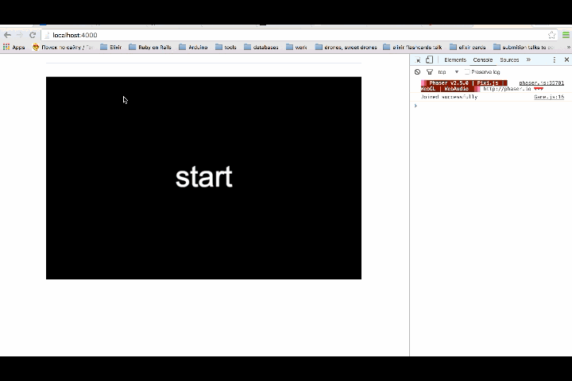

# Building learn to touch type glove with Elixir and Arduino gifs

Presentation I've given at ElixirConf US in 2016.

### slides are here: http://goo.gl/iS5K0j

### Typing competition

### Get text

### Testing that sensor is working

### Testing that sensors are sending correct values

### Feeling when things DO work

### Demo

